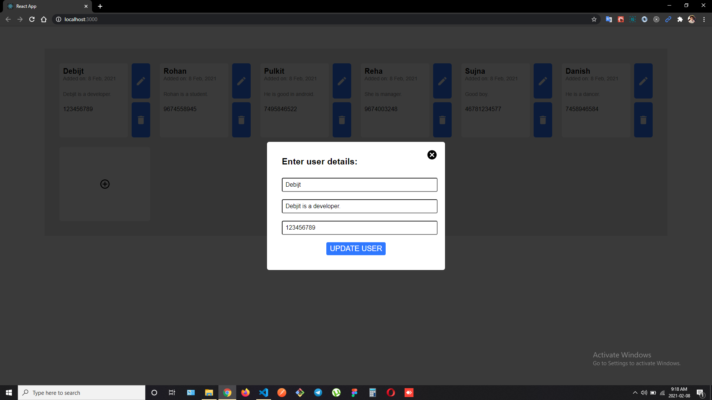

# MERN STACK CRUD APP

Hi! I'm Debjit, a **MERN Stack Developer**. This is a simple **REALTIME CRUD** App.
I have created it with **React JS** in frontend, **Node.js, Express.js** in backend and **MongoDB** for storing data.
 

 

## Features

- Enter required details in the form.
- Create user.
- Update user.
- Get list of users from databse.
- Delete user.

##  NPM Packages Used

- 
- Websocket (Socket IO)
- Mongoose
- Express
- Cors
- Nodemon

## Screenshots

 

 

 
 
 
